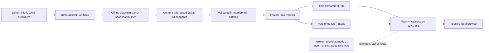

# ADR-001 — Local QME UI Architecture

Status: `PREFERRED FOR LOCAL V0.1`

Local release status: `NOT IMPLEMENTED`

Decision date: 2026-08-10

Implementation evidence state: `PLANNING_ONLY`

Decision owner: QME architecture review

Independent review: [UI Architecture Independent Review](UI_ARCHITECTURE_INDEPENDENT_REVIEW.md)

Product contract: [QME Ticker Scores UI Specification](QME_TICKER_SCORES_UI_SPEC.md)

Living status: [QME Implementation Memory](../implementation/QME_IMPLEMENTATION_MEMORY.md)

## 1. Decision

QME v0.1 will use a single-user, local-only, server-rendered Python application with:

- canonical QME producer artifacts carrying schemas, hashes, and run/data/config/code
  lineage;
- an offline `qme.ui_snapshot` builder that creates deterministic, content-addressed
  JSON presentation snapshots without recomputing quantitative results;
- a framework-independent Python catalog and frozen read models;
- Flask and Jinja for semantic HTML and versioned JSON routes;
- Waitress bound only to `127.0.0.1`;
- only `GET` and `HEAD` application routes;
- first-party CSS and minimal first-party vanilla JavaScript;
- an optional PyInstaller `onedir` Windows release after the portable Python build
  passes clean-machine tests;
- Python Playwright as test tooling, not a runtime dependency.

There is no Node, npm, React, TypeScript, database, ORM, WebSocket, service worker,
filesystem watcher, CDN, remote font, frontend package manager, user login, cookie
state, or order-control surface in v0.1.

This decision selects an implementation direction. It does not claim that the UI or
its producer contracts exist. The evidence state remains `PLANNING_ONLY` until code,
tests, and exact-commit evidence satisfy the gates in this ADR.

## 2. Local trust model

The application is for one owner on one local Windows computer. The owner account,
configured artifact directory, and local repository are trusted. The design must detect
accidental corruption, partial publication, wrong-run selection, incompatible schemas,
and quantitative-display drift. It does not claim protection against a malicious
same-user process, a local administrator, or a compromised operating system.

SHA-256 content hashes provide integrity and reproducibility checks. They do not prove
origin against an adversary who can replace both an artifact and its manifest. If the
application later reads shared or remote artifact roots, permits multiple users, binds
outside loopback, or exposes mutation authority, a new architecture decision and threat
model are required.

## 3. Why this architecture

The product is a single-user, offline, read-only viewer whose first registered scale is
at most 200 universe rows. It needs trustworthy provenance, complete Nasdaq membership,
accessible tables, and deterministic display more than it needs client-side application
state.

A React/Vite SPA is viable but adds a second schema and formatting implementation, a
Node dependency graph, frontend routing and state, and additional locations where
canonical calculations could leak into browser code. No current requirement justifies
that complexity.

Server rendering keeps one Python read model for HTML and JSON. The JSON routes preserve
a migration boundary if a future measured requirement justifies another client.

## 4. Decision comparison

Scores are architectural judgments from 1–5 for the registered local-only scope, not
benchmark measurements.

| Candidate | Simplicity 15% | Evidence correctness 20% | Windows/offline 15% | Local safety 15% | Accessibility 10% | Testability 10% | Product fit 10% | Maintainability 5% | Weighted |
|---|---:|---:|---:|---:|---:|---:|---:|---:|---:|
| Flask/Jinja/Waitress | 5 | 5 | 5 | 4 | 5 | 5 | 4 | 5 | **4.75** |
| Generated static export | 5 | 5 | 5 | 5 | 5 | 5 | 2 | 4 | 4.65 |
| FastAPI + React/Vite | 2 | 4 | 3 | 3 | 4 | 4 | 5 | 3 | 3.45 |
| PySide6 desktop | 3 | 5 | 3 | 5 | 4 | 3 | 4 | 3 | 3.90 |
| Tauri/Python sidecar | 1 | 4 | 2 | 3 | 4 | 3 | 5 | 2 | 3.00 |

## 5. System architecture



The only viewer integration boundary is a validated JSON UI snapshot. The viewer never
reads provider credentials, starts a QME run, calls a model, talks to a broker, creates
a broker preview, or changes canonical artifacts.

## 6. Deterministic UI snapshot contract — G1

### 6.1 Logical layout

```text
producer-results/<run_id>/
  manifest.json
  universe_scores.v1.json
  portfolio.json
  risk.json
  agent_batch.json
  operations/
  tickers/<security_id>/

ui-snapshots/<ui_snapshot_hash>/
  snapshot-manifest.json
  run.json
  universe.json
  securities.json
  portfolio.json
  risk.json
  agent-reviews.json
  operations.json
```

`ui_snapshot_hash` is the SHA-256 of the exact canonical UTF-8 bytes of
`snapshot-manifest.json`. The directory basename must equal that hash. The manifest is
the sole non-indexed control file; every payload appears exactly once in
`artifact_index` with logical ID, relative path, byte size, SHA-256, and schema version.

The snapshot manifest binds at minimum:

- run ID, `analysis_as_of`, generation time, and terminal run state;
- producer-manifest hash and producer code/config/data/policy/schema identities;
- snapshot-builder code revision;
- adapter registry, field mapping, formatting, redaction, and state-policy hashes;
- exact membership snapshot ID, member set hash, member count, and member-status counts;
- every output payload path, size, hash, and schema.

### 6.2 Projection boundary

Every output field has a committed mapping:

```text
output_field
source_artifact_id
source_json_pointer
source_schema_version
transform = COPY | REDACT | DERIVED_PRESENTATION
transform_version
unit
scale
display_precision
rounding_mode
missing_policy
```

Rules:

- No implicit default is allowed.
- Missing required input makes the snapshot invalid.
- Momentum, factors, scores, ranks, eligibility, selection, weights, risk, capacity,
  costs, P&L, tax, portfolio totals, and agent review-set membership are copied from
  producer artifacts and never recalculated.
- `DERIVED_PRESENTATION` is limited to redaction, text formatting, safe labels, and
  presentation sort keys.
- Canonical overview totals are copied and reconciled to exact constituent IDs.
- Degraded, stale, missing, blocked, and invalid membership rows remain present.

## 7. Numeric representation — G2

Every present displayed numeric value carries:

```text
canonical_decimal     # finite base-10 string
display_decimal       # finite base-10 string after scale/rounding
unit
scale                 # finite base-10 string, strictly > 0
display_precision
rounding_mode
display_text          # produced offline
sort_key              # opaque presentation key/ordinal
missing_state
source_pointer
source_artifact_hash
```

For `missing_state=PRESENT`, both decimal strings and `scale > 0` are required. For all
other missing states, both decimals are absent. The snapshot builder uses one registered
Decimal implementation and enforces:

```text
abs((display_decimal / scale) - canonical_decimal)
    <= 0.5 * 10^(-display_precision) / scale
display_text = format(display_decimal, registered unit/locale policy)
```

Tests cover positive and negative half ties, negative zero, fraction-to-percent scale,
missing states, very small and large finite values, and overflow.

The browser displays `display_text` exactly. It must not parse canonical or display
decimals with `Number`, `parseFloat`, or an equivalent conversion. Charts requiring
numeric conversion are deferred unless a separate differential test proves the
transform is presentation-only and reconciles exactly to snapshot rows.

## 8. Exact Nasdaq membership reconciliation — G3

Producer, snapshot builder, and viewer use the same versioned construction:

```text
SHA-256(
  UTF8("QME_MEMBERSHIP_SET_V1\0") ||
  canonical_utf8_json_array(sort_utf8(normalize_NFC(security_ids)))
)
```

The canonical array has no BOM or whitespace, uses the registered JSON escaping,
preserves case, and contains each schema-valid ID exactly once. Duplicate normalized
IDs, invalid Unicode, or case/normalization collisions are `CONFLICTING`.

A run is complete only when all identities hold:

```text
unique(projected_security_ids) = manifest_membership_security_id_set
membership_set_sha256(projected_security_ids) = manifest.membership_hash
count(unique(projected_security_ids)) = manifest.membership_count
sum(member_status_counts[b] for every registered bucket b) = manifest.membership_count
```

Registered member buckets are `VALID`, `DEGRADED`, `STALE`, `MISSING`, `BLOCKED`, and
`INVALID`. Count equality alone cannot establish completeness.

## 9. Publication and load protocol — G4

### 9.1 Snapshot publication

1. Build in a sibling same-volume staging directory.
2. Close and hash every payload.
3. Write canonical `snapshot-manifest.json` last.
4. Compute its hash and rename once into a never-before-used content-addressed directory.
5. Never overwrite or mutate a published snapshot directory.

The exact Windows durability behavior is measured by fixture tests rather than assumed.

### 9.2 Viewer load

Before listening, the viewer:

1. resolves the configured snapshot root;
2. accepts only bounded regular files under that root and rejects traversal or escape;
3. validates the snapshot manifest schema and directory/hash identity;
4. reads each indexed file once into bounded bytes;
5. hashes and parses those same bytes;
6. rejects missing, extra, duplicate, changed, or unindexed payloads;
7. reconciles the exact membership set, hash, counts, and completeness state;
8. builds immutable thread-safe read models.

Each valid snapshot is indexed by `(run_id, ui_snapshot_hash)`. A run ID alone never
selects data. Same run ID with different snapshot hashes is a visible conflict, not an
implicit update. Malformed snapshots are listed only by local discovery identifier and
error class; their payloads are not rendered. One malformed snapshot does not prevent
other valid snapshots from loading.

After readiness, the viewer does not reread a loaded snapshot. New runs become visible
after an explicit restart in v0.1. There is no database or mutable viewer cache.

## 10. Module and authority boundary — G5

Planned layout:

```text
qme/ui_snapshot/
  mapping.py
  formatting.py
  redaction.py
  publish.py
qme/ui/
  catalog/
  read_models/
  web/
    app.py
    routes_html.py
    routes_api.py
    templates/
    static/
  cli.py
```

Import rules:

- Snapshot builder and viewer are separate CLI entry points; they may share one locked
  Python distribution.
- `qme.ui.catalog` and `qme.ui.read_models` do not import Flask.
- `qme.ui.web` imports only catalog, read-model, and rendering helpers.
- The viewer imports no market-data, membership-acquisition, strategy, backtest, broker,
  order, model, TradingAgents, Linear, Git, or cloud client.
- The viewer has no general subprocess or shell capability and no filesystem-write API.
- Agent output remains report-only and cannot change deterministic fields or hashes.

## 11. Local HTTP boundary — G6

- Bind only `127.0.0.1` before opening the browser. Never bind a wildcard or silently
  scan/fall back across ports.
- Disable IPv6 until separately tested.
- Disable debug, reload, Flask development server, stack traces, directory browsing,
  dynamic static paths, and API documentation routes.
- Bound headers, URL/query length, request body, response size, threads, concurrent
  requests, artifact count, bytes, depth, and untrusted text.
- All application routes are `GET` or `HEAD`; every other method is absent or returns
  405.
- The browser receives no provider, model, broker, GitHub, Linear, or cloud credentials.
- The viewer makes no provider, model, broker, or cloud request.

Required routes:

```text
GET|HEAD /health/build
GET|HEAD /
GET|HEAD /runs
GET|HEAD /runs/<run_id>/<ui_snapshot_hash>
GET|HEAD /runs/<run_id>/<ui_snapshot_hash>/universe
GET|HEAD /runs/<run_id>/<ui_snapshot_hash>/securities/<security_id>
GET|HEAD /runs/<run_id>/<ui_snapshot_hash>/portfolio
GET|HEAD /runs/<run_id>/<ui_snapshot_hash>/risk
GET|HEAD /runs/<run_id>/<ui_snapshot_hash>/agent-reviews
GET|HEAD /runs/<run_id>/<ui_snapshot_hash>/operations
GET|HEAD /runs/<run_id>/<ui_snapshot_hash>/provenance/<artifact_id>
GET|HEAD /api/v1/runs
GET|HEAD /api/v1/runs/<run_id>/<ui_snapshot_hash>/...
```

There is no login, session, cookie, or mutation bootstrap. Any future remote binding,
multi-user access, or write route requires a new ADR.

## 12. State model

Completeness and run quality are orthogonal.

Completeness:

```text
CONFLICTING
INCOMPLETE
COMPLETE
```

Run-quality precedence, earliest applicable state wins:

```text
CORRUPT
CONFLICTING
UNSUPPORTED_SCHEMA
INVALID
MISSING
BLOCKED
STALE
DEGRADED
VALID
```

| Condition | State |
|---|---|
| Hash, byte, or parser failure under a recognized envelope | `CORRUPT` |
| Duplicate authority, set/count contradiction, or same identity/different hash | `CONFLICTING` |
| Unsupported schema version or unknown schema name | `UNSUPPORTED_SCHEMA` |
| Known schema with unknown enum, illegal field, or semantic invariant failure | `INVALID` |

No unknown maps to `VALID`, false, zero, blank, or `Hold`.

## 13. Browser rendering and offline behavior

- Use only bundled first-party assets; no CDN, remote font, telemetry, service worker,
  local storage, or IndexedDB.
- Keep Jinja autoescape enabled. Application templates may not use `|safe`, Markup,
  artifact-derived HTML, style, or executable URL content.
- Treat agent/provider/source text, filenames, tickers, company names, and URIs as plain
  text.
- Apply a basic local CSP: `default-src 'none'; script-src 'self'; style-src 'self';
  img-src 'self'; object-src 'none'; base-uri 'none'; frame-ancestors 'none'`.
- Do not place secrets, raw tokens, full account identifiers, or private absolute paths
  in browser payloads, errors, or URLs.
- Mask account identity by default so screenshots and exported diagnostics remain safer
  to share; this is a presentation policy, not an access-control claim.

## 14. UI and accessibility

- Standard page navigation and GET forms work without JavaScript.
- The universe uses a native, non-virtualized `<table>` for the <=200-row profile.
- Captions, `<th>`, `scope`, simple headers, and accessible row links preserve table
  relationships.
- Sort/filter/search use presentation keys only and preserve the official full member
  denominator and snapshot hash.
- Status always has text; color is supplementary.
- Charts are deferred until they have a canonical-key table equivalent and pass the
  numeric/provenance rules.
- WCAG 2.2 AA acceptance combines automation with keyboard, zoom/reflow, high contrast,
  reduced motion, and registered Windows screen-reader/browser review.

## 15. Packaging and runtime

Development form:

- Python virtual environment and wheel;
- separately locked UI runtime and test extras;
- no UI dependency in the base deterministic package until dependency and architecture
  gates are accepted.

Optional release form:

- PyInstaller `onedir`, built on pinned Windows;
- pinned spec file and `--noupx`;
- explicit inclusion of templates, static assets, and schemas;
- release manifest with exact file hashes, SBOM, and dependency/license review;
- standard-user clean Windows VM test with no Python, Node, Git, or internet;
- offline launch, port collision, crash/restart, paths with spaces/non-ASCII, and no
  residual process tests.

The UI uses no GPU and does not affect local-LLM hardware sizing.

## 16. Acceptance evidence

Required correctness and reproducibility evidence:

- exact membership security-ID set equality and uniqueness, not count only;
- all six member-status counts sum exactly to membership count;
- 100 randomized discovery orders produce byte-identical canonical JSON;
- zero accepted bad hash, schema, path, duplicate-authority, partial, extra-file, or
  changed-during-read cases;
- every displayed value matches snapshot `display_text` exactly and traces to its source
  pointer and artifact hash;
- UI access leaves source bytes, mtimes, deterministic result hashes, portfolio/order
  hashes, and agent artifacts unchanged;
- route enumeration finds only `GET` and `HEAD` and no broker/order/model/provider action;
- packaged module/file audit finds no forbidden runtime clients;
- full keyboard/accessibility and clean-machine checks pass on the exact tested commit.

Performance hypotheses are not claims. The spike records hardware, OS, browser, corpus,
cold/warm state, sample size, and raw measurements before freezing budgets:

- at least 30 cold snapshot loads/starts;
- at least 500 warm route requests;
- at least 100 sort/filter operations;
- p50/p95/p99 where sample size supports them;
- peak/steady RSS, package/static size, response size, and startup-to-usable time.

The provisional targets are cold/start-to-usable p95 <=2 seconds, warm route p95 <=500
ms, and sort/filter p95 <=100 ms. They become release gates only after measured review.

## 17. Implementation plan

### Stage 0 — Freeze contracts and fixtures

- Commit this ADR, snapshot manifest schema, field map, membership construction,
  numeric formatting policy, state/completeness rules, endpoint schemas, resource limits,
  and benchmark protocol.
- Create valid, degraded, stale, missing, blocked, invalid, corrupt, conflicting,
  partial, unknown-schema, path, precision, and membership fixtures.

Exit: every displayed field maps to a producer pointer or registered presentation
derivation; no orphan calculation exists.

### Stage 1 — Build deterministic UI snapshots

- Implement producer manifest/hash validation.
- Implement field mapping, Decimal formatting, exact membership reconciliation, payload
  hashing, and atomic content-addressed publication.

Exit: the builder invents no quantitative value and identical inputs produce identical
snapshot bytes.

### Stage 2 — Build local catalog and viewer shell

- Implement bounded same-byte load, immutable snapshots, quarantine records, run routes,
  local listener, and minimal Flask/Jinja/Waitress shell.

Exit: all invalid fixtures fail closed, valid runs remain usable, and only `GET`/`HEAD`
routes exist.

### Stage 3 — Build research dashboard

- Implement overview, full universe, security detail, provenance, and portfolio/risk.

### Stage 4 — Add report-only agent and operations evidence

- Add agent views after typed batch contracts are accepted.
- Add preview/reconciliation views after canonical operations artifacts exist.
- Introduce no broker action.

### Stage 5 — Qualify local release

- Complete exact-commit deterministic, accessibility, performance, dependency,
  packaging, and clean-machine gates.
- Update implementation memory and Linear evidence state. This ADR alone never moves
  implementation beyond `PLANNING_ONLY`.

## 18. Reversal triggers

A SPA, desktop shell, database, watcher, streaming protocol, remote binding, multiple
users, shared artifact root, or any mutation route requires a new ADR.

## 19. Consequences

Benefits:

- one Python schema and formatting implementation;
- no frontend build or runtime state system;
- complete offline operation;
- deterministic content-addressed evidence;
- accessible native tables;
- narrow migration boundary through optional JSON routes.

Costs and limitations:

- the local user and filesystem are trusted;
- hashes detect corruption but do not authenticate against local tampering;
- new runs require viewer restart in v0.1;
- rich client-side charts and live updates are deferred;
- snapshot-builder and producer schemas must evolve together.

## 20. Primary technical references

- [Flask templates and Jinja autoescaping](https://flask.palletsprojects.com/en/stable/templating/)
- [Flask application factories](https://flask.palletsprojects.com/en/stable/patterns/appfactories/)
- [Flask testing](https://flask.palletsprojects.com/en/stable/testing/)
- [Flask deployment with Waitress](https://flask.palletsprojects.com/en/stable/deploying/waitress/)
- [Waitress server arguments](https://docs.pylonsproject.org/projects/waitress/en/latest/arguments.html)
- [PyInstaller usage](https://pyinstaller.org/en/stable/usage.html)
- [W3C accessible table guidance](https://www.w3.org/WAI/tutorials/tables/)
- [WCAG 2.2](https://www.w3.org/TR/WCAG22/)
- [Playwright Python ARIA snapshots](https://playwright.dev/python/docs/aria-snapshots)
